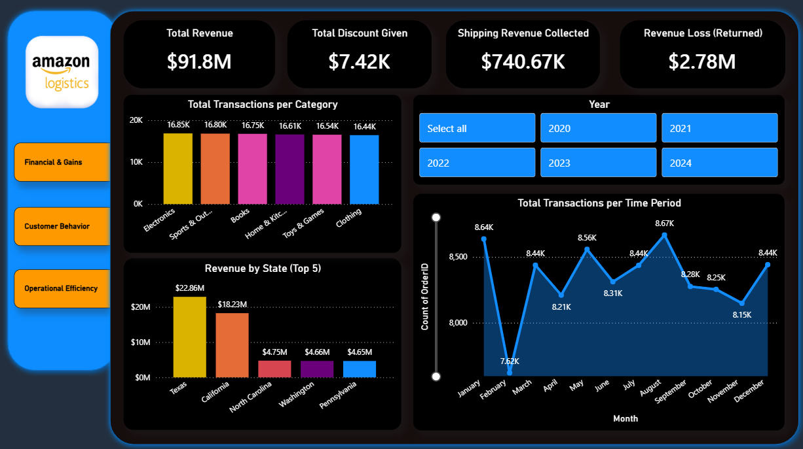
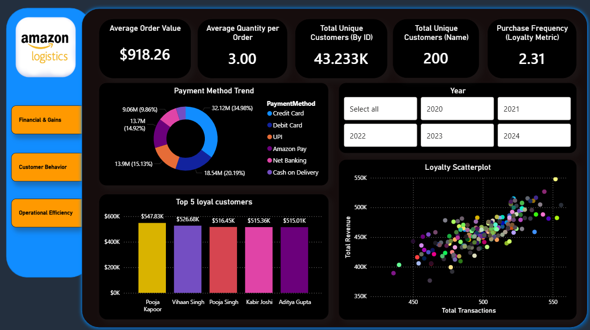
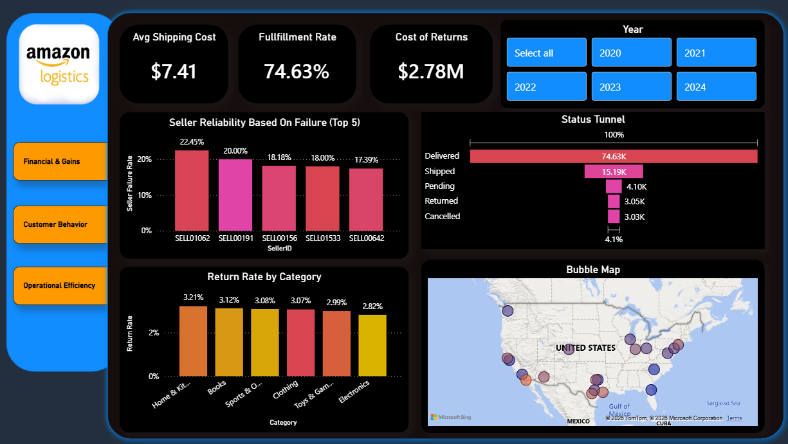
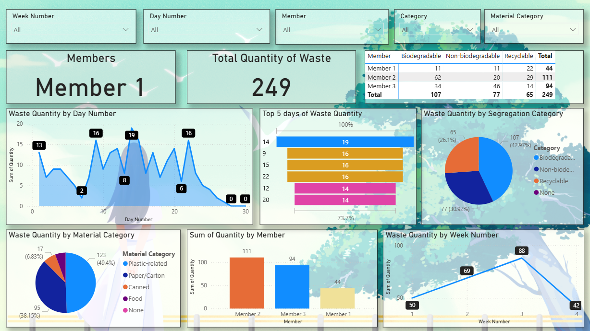
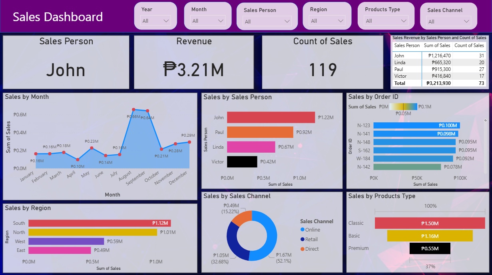
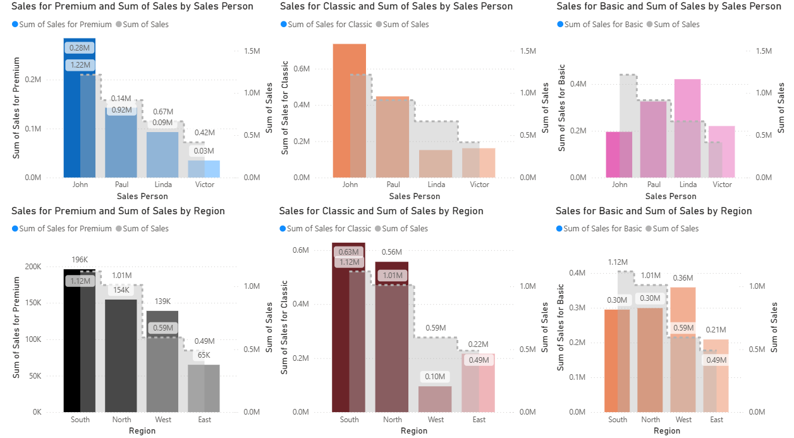
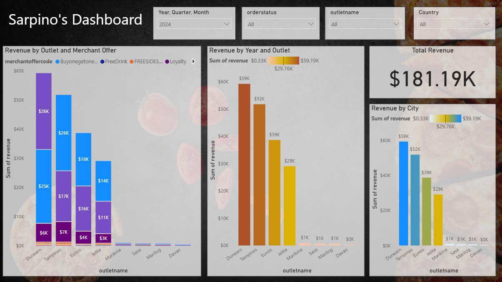
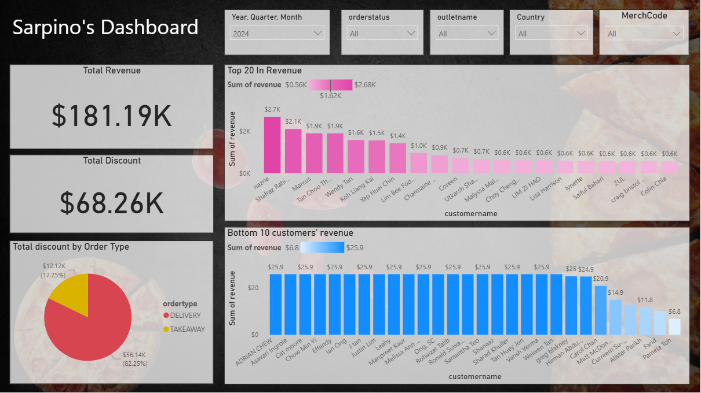
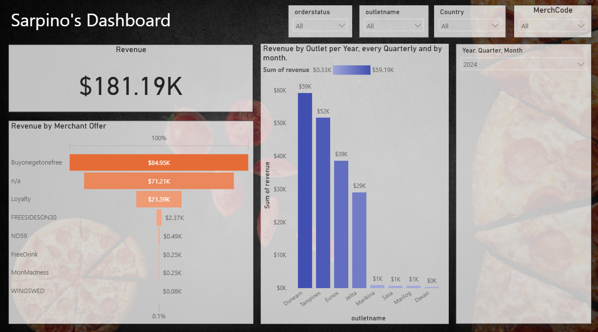
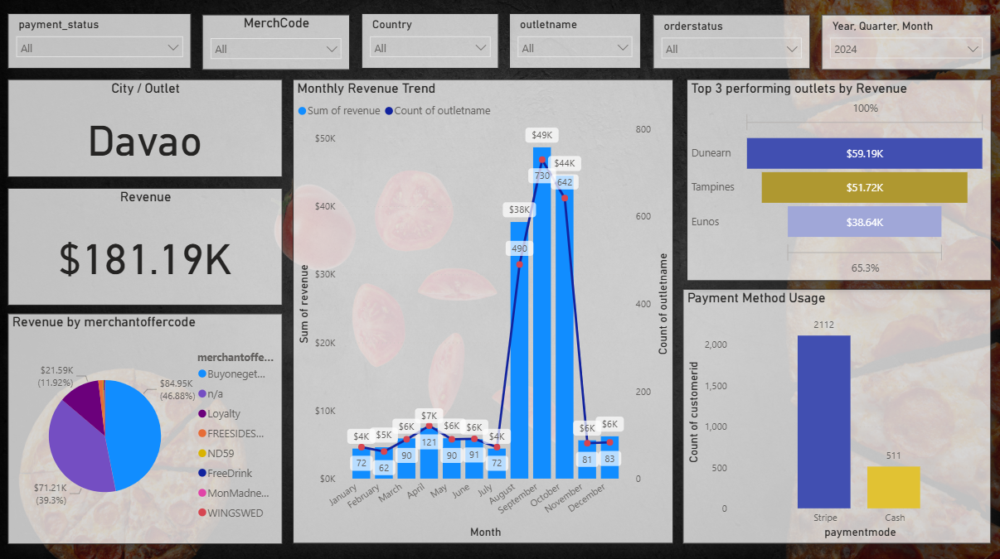

# Dashboard-Projects

A collection of Power BI and Tableau dashboard projects built for data analysis and business intelligence practice.

---

## Projects

### 1. Amazon Logistics Dashboard (Power BI)

A multi-page Power BI dashboard built on synthetic Amazon sales data, covering three analytical perspectives:

**Financial & Gains**

Overview of key financial metrics including Total Revenue ($91.8M), Total Discount Given, Shipping Revenue Collected ($740.67K), and Revenue Loss from Returns ($2.78M). Includes transaction breakdowns by category and state, plus a monthly trend line.

**Customer Behavior**

Analyzes customer purchasing patterns — Average Order Value ($918.26), Purchase Frequency (Loyalty Metric), payment method distribution via donut chart, top 5 loyal customers by revenue, and a loyalty scatterplot correlating total transactions with total revenue.

**Operational Efficiency**

Focuses on logistics performance: Average Shipping Cost ($7.41), Fulfillment Rate (74.63%), Cost of Returns ($2.78M), seller reliability by failure rate (Top 5), return rate by product category, and a geographic bubble map of order distribution across the US.

---

### 2. BI Environment Overview

A Power BI dashboard tracking household waste segregation data. Displays waste quantity by member, segregation category (Biodegradable, Non-biodegradable, Recyclable), material type, day/week trends, and top waste days. Built with slicers for filtering by week, day, member, and material category.

---

### 3. Sales Dashboard Analysis (Power BI)

A two-page Power BI sales dashboard for a small sales team.

**Overview Page**

Tracks total revenue (₱3.21M), count of sales (119), and top salesperson (John). Visualizes sales by month, region, salesperson, order ID, sales channel (Online/Retail/Direct), and product type (Classic/Basic/Premium).

**Drill-Down Page**

Side-by-side comparison charts breaking down sales for each product type (Premium, Classic, Basic) by both salesperson and region, using a combo bar chart to compare product-specific sales against total sales.

---

### 4. Sarpino's Pizza Dashboard (Power BI)

A multi-page Power BI dashboard built on Sarpino's pizza chain sales data across multiple outlet locations.

**Revenue by Merchant Offer**

Shows total revenue of $181.19K with a breakdown by merchant offer code (Buy-one-get-one-free leads at $84.95K). Also displays revenue by outlet and quarterly/monthly trends for 2024.

**Revenue by Outlet & Year**

Stacked bar chart showing revenue contribution by merchant offer per outlet, alongside a revenue-by-year comparison across all outlets. Dunearn leads with $59K.

**Customer Revenue Rankings**

Highlights the Top 20 customers by revenue and Bottom 10 customers, along with total discount given ($68.26K) and a breakdown of discount by order type (Delivery vs Takeaway).

**Monthly Trends & Payment Methods**

Displays city/outlet filter (defaulting to Davao), monthly revenue trend chart, top 3 performing outlets, and payment method usage (Stripe vs Cash).

---

## Tools Used

- **Microsoft Power BI** — primary dashboard tool for all projects
- **Synthetic / sample datasets** — Amazon logistics data, pizza chain sales, household waste logs, and small business sales records
- **GitHub** — version control and portfolio hosting

---

*Built by Zachary Lorenzo Sulit*
